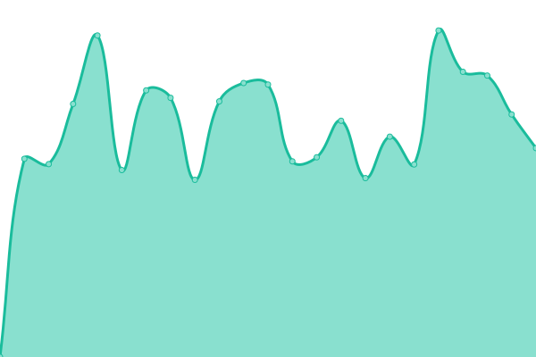

# [📈 Live Status](https://Vikingfr.github.io/upptime): <!--live status--> **🟧 Partial outage**

This repository contains the open-source uptime monitor and status page for [M.JEANNE](https://Vikingfr.github.io/upptime), powered by [Upptime](https://github.com/upptime/upptime).

With [Upptime](https://upptime.js.org), you can get your own unlimited and free uptime monitor and status page, powered entirely by a GitHub repository. We use [Issues](https://github.com/Vikingfr/upptime/issues) as incident reports, [Actions](https://github.com/Vikingfr/upptime/actions) as uptime monitors, and [Pages](https://Vikingfr.github.io/upptime) for the status page.

<!--start: status pages-->
<!-- This summary is generated by Upptime (https://github.com/upptime/upptime) -->
<!-- Do not edit this manually, your changes will be overwritten -->
<!-- prettier-ignore -->
| URL | Status | History | Response Time | Uptime |
| --- | ------ | ------- | ------------- | ------ |
|  [ASIP](https://asip10.fr) | 🟩 Up | [asip.yml](https://github.com/Vikingfr/upptime/commits/HEAD/history/asip.yml) | 

 1717ms
     
 | 

<a href="https://Vikingfr.github.io/upptime/history/asip">86.26%</a>
    

|  SCOP276 | 🟩 Up | [scop-276.yml](https://github.com/Vikingfr/upptime/commits/HEAD/history/scop-276.yml) | 

 979ms
     
 | 

<a href="https://Vikingfr.github.io/upptime/history/scop-276">100.00%</a>
    

|  Les Corbeilles de Claude | 🟩 Up | [les-corbeilles-de-claude.yml](https://github.com/Vikingfr/upptime/commits/HEAD/history/les-corbeilles-de-claude.yml) | 

 1863ms
     
 | 

<a href="https://Vikingfr.github.io/upptime/history/les-corbeilles-de-claude">86.26%</a>
    

|  K-Jet | 🟩 Up | [k-jet.yml](https://github.com/Vikingfr/upptime/commits/HEAD/history/k-jet.yml) | 

 5257ms
     
 | 

<a href="https://Vikingfr.github.io/upptime/history/k-jet">86.26%</a>
    

|  AceHoliday | 🟩 Up | [ace-holiday.yml](https://github.com/Vikingfr/upptime/commits/HEAD/history/ace-holiday.yml) | 

 1310ms
     
 | 

<a href="https://Vikingfr.github.io/upptime/history/ace-holiday">86.26%</a>
    

|  collectedememoire | 🟥 Down | [collectedememoire.yml](https://github.com/Vikingfr/upptime/commits/HEAD/history/collectedememoire.yml) | 

 0ms
     
 | 

<a href="https://Vikingfr.github.io/upptime/history/collectedememoire">0.00%</a>
    

|  flashform | 🟩 Up | [flashform.yml](https://github.com/Vikingfr/upptime/commits/HEAD/history/flashform.yml) | 

 3158ms
     
 | 

<a href="https://Vikingfr.github.io/upptime/history/flashform">98.40%</a>
    

|  kuriosity Club | 🟩 Up | [kuriosity-club.yml](https://github.com/Vikingfr/upptime/commits/HEAD/history/kuriosity-club.yml) | 

 2758ms
     
 | 

<a href="https://Vikingfr.github.io/upptime/history/kuriosity-club">86.36%</a>
    

|  Cloud Asip | 🟩 Up | [cloud-asip.yml](https://github.com/Vikingfr/upptime/commits/HEAD/history/cloud-asip.yml) | 

 3150ms
     
 | 

<a href="https://Vikingfr.github.io/upptime/history/cloud-asip">86.36%</a>
    

|  Rue de la coloc | 🟩 Up | [rue-de-la-coloc.yml](https://github.com/Vikingfr/upptime/commits/HEAD/history/rue-de-la-coloc.yml) | 

 6557ms
     
 | 

<a href="https://Vikingfr.github.io/upptime/history/rue-de-la-coloc">86.20%</a>
    

|  [Google (to check system)](https://www.google.com) | 🟩 Up | [google-to-check-system.yml](https://github.com/Vikingfr/upptime/commits/HEAD/history/google-to-check-system.yml) | 

 70ms
     
 | 

<a href="https://Vikingfr.github.io/upptime/history/google-to-check-system">100.00%</a>
    

<!--end: status pages-->

[**Visit our status website →**](https://Vikingfr.github.io/upptime)

## 📄 License

- Powered by: [Upptime](https://github.com/upptime/upptime)
- Code: [MIT](./LICENSE) © [M.JEANNE](https://Vikingfr.github.io/upptime)
- Data in the `./history` directory: [Open Database License](https://opendatacommons.org/licenses/odbl/1-0/)
